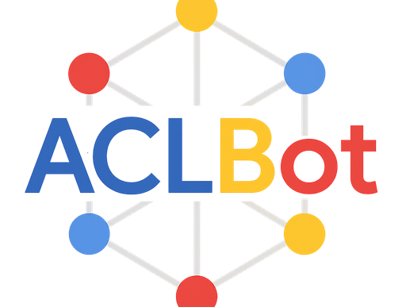
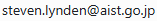

# ACLBot: Knowledge Graph–Driven ACL Research Assistant

<p align="center">
  
</p>

This repository contains code for the paper:

**_ACLBot: A Knowledge Graph-Driven Assistant for ACL Anthology Research_** Jan Buchmann, Steven Lynden, and Kristiina Jokinen at **LREC 2026**

## ACLBot: A Knowledge Graph-Driven Assistant for ACL Anthology Research

ACLBot is an interactive research assistant designed to support exploration of the **ACL Anthology** by combining structured knowledge graph retrieval with large language model (LLM) dialogue generation. The system integrates a **Neo4j-based knowledge graph** constructed from ACL Anthology data (papers, authors, topics, and research trends) with LLM-based query generation and response synthesis. User questions are translated into structured queries, executed over the knowledge graph, and the retrieved results are re-injected into the LLM to produce **concise, contextually grounded answers**.

This hybrid approach enables:
- 🔍 **Exploratory literature search** across thousands of NLP papers  
- 🧠 **Grounded responses** that reduce hallucination compared to standard LLMs  
- 📊 **Trend analysis and visualization** (e.g., model usage over time)  
- 🔗 **Integration of symbolic and semantic retrieval** for flexible querying  

---

ACLBot requires a large (>50GB) database of structured data, which must be installed in a **Neo4j** instance. The database can be built from scratch by extracting data from the ACL Anthology using an LLM-based pipeline. Alternatively, a pre-built database dump is available. Due to its size and institutional constraints, the database dump is not hosted here. We are in the process of obtaining administrative approval for public distribution. In the meantime, if you are interested in accessing the pre-built database dump, please contact us via the following email address:



## Table of Contents
- Setup
- Neo4j Setup
- Data Preparation
- Knowledge Graph Construction
- Running the System
- Licensing
- Contact

## Setup

### Miniconda3 installation

```bash
# Download
wget https://repo.anaconda.com/miniconda/Miniconda3-latest-Linux-x86_64.sh

# Install, accept all prompts
bash Miniconda3-latest-Linux-x86_64.sh
```

Restart shell, then verify installation success 

```bash
conda list
```

### Data

In the `aclbot` folder, create the following directories:

```txt
data/
    extracted_data/
    json/
    neo4j/
        data/    
    recorded_chats/
    tmp_pdf/
    txt/
    xml/
plots/ 
```

Create a file `data/openai_cost.csv` for tracking OpenAI costs. Then paste the following contents (the file should end with an empty line).

```txt
date,cost,accumulated_cost
-,0.0,0.0

```

### dotenv file

Set up a file `.env` specifying the following variables: 

```
NEO4J_URI=bolt://localhost:7687
NEO4J_USER=neo4j
NEO4J_PASSWORD=<your_neo4j_password>
OPENAI_API_KEY=<your_openai_key>
```

## Neo4j Setup

If you plan to build the neo4j database from scratch, create a directory for data storage:

```bash
mkdir /path/to/this/repo/data/neo4j/data
```

If you plan to start from an existing database, move its files so that they are in exactly that location.

#### Download and run neo4j

The system was developed and tested using Neo4j enterprise edition but should work, with varying performance, with other distributions. Run the command below to download and run neo4j. When running it the next time, it will use the cached docker image. When running this for the first time, a username and password might need to be entered. Use the default `neo4j` username and choose a password. Replace `/path/to/this/repo` with the path on your system.

```bash
sudo docker run --publish=7474:7474 --publish=7687:7687 --volume=/path/to/this/repo/data/neo4j/data:/data --env=NEO4J_ACCEPT_LICENSE_AGREEMENT=eval neo4j:5.26.1-enterprise
```

If you are building the database from scratch, it will have the default username `neo4j` and password `neo4j`. Click on the link shown in the terminal to open neo4j in the browser. Connect to the database and then select a new password of your choice.

#### Stopping neo4j

To stop neo4j, first get its docker process id

```bash
sudo docker ps
```

Then terminate the process (replace `PROCESS_ID`).

```bash
sudo docker stop PROCESS_ID
```

## Creating the graph from scratch

Several of the scripts use multiprocessing. Use the `--n_processes` argument to adjust the number of processes used (the default is 4). 

### 1. Download ACL Anthology dataset

Download the ACL Anthology dataset (the raw grobid extraction results) from [here](https://drive.google.com/file/d/1xC-K6__W3FCalIDBlDROeN4d4xh0IVry/view?usp=sharing). Extract all files and move the files in thee resulting `grobid_full_text` folder to `path/to/this/repo/data/xml`.

### 2. Add XML files that are missing from the ACL anthology dataset

#### 2.1 Setup GROBID

1. Install NVIDIA container toolkit (from these [instructions](https://docs.nvidia.com/datacenter/cloud-native/container-toolkit/latest/install-guide.html))

```bash
# Configure production repository
curl -fsSL https://nvidia.github.io/libnvidia-container/gpgkey | sudo gpg --dearmor -o /usr/share/keyrings/nvidia-container-toolkit-keyring.gpg \
  && curl -s -L https://nvidia.github.io/libnvidia-container/stable/deb/nvidia-container-toolkit.list | \
    sed 's#deb https://#deb [signed-by=/usr/share/keyrings/nvidia-container-toolkit-keyring.gpg] https://#g' | \
    sudo tee /etc/apt/sources.list.d/nvidia-container-toolkit.list

# Update the packages list from the repository:
sudo apt-get update

# Install the NVIDIA Container Toolkit packages
sudo apt-get install -y nvidia-container-toolkit
```

2. Restart the machine

3. Run GROBID Docker image (will download automatically). There is a full version and a light version, which not as accurate, but runs faster ([documentation](https://grobid.readthedocs.io/en/latest/Run-Grobid/)). 

```bash
# Full version
sudo docker run --rm --gpus all --init --ulimit core=0 -p 8070:8070 grobid/grobid:0.8.1

# Light version
sudo docker run --rm --init --ulimit core=0 -p 8070:8070 lfoppiano/grobid:0.8.1
```

#### 2.2 Download missing pdfs and convert to xml

4. Run `get_missing_xmls.py`. By default, this will check the files in `data/datasets/acl-anthology/grobid_full_text`. It will download all papers from the ACL anthology that are missing in that folder in pdf format and then convert them to xml. It processes files in batches of 1000 and deletes the pdfs afterwards.

5. Stop GROBID

Get the docker process id of GROBID by running

```bash
sudo docker ps
```

Then stop GROBID by running

```bash
sudo docker stop PROCESS_ID
```

### 3. Convert GROBID xml files to Intertext Graph (ITG) jsons

Run `process_grobid_xml.py`. This will convert each xml file to the [Intertext graph](https://github.com/UKPLab/intertext-graph) format and write the results as jsons. This data format preserves the full hierarchical structure of the paper texts. These jsons will be used in the extraction of contributions and area and as the basis for adding full texts to the graph. 

```bash
python process_grobid_xml.py data/xml data/json
```

### 4. Convert ACL pdfs to txt using pypdf

While the jsons preserve the full hierarchical structure, the quality of tables in these files is bad. This is problematic for results extraction, where we require accurate tables.

Therefore we also convert the ACL pdfs to txt using pypdf. 

Run `get_txts.py` to download pdfs from the acl anthology and to convert them to txt. The pdfs will be deleted after conversion. The txts are stored in `data/txt` by default.

```bash
python get_txts.py
```

### 5. Extract data from jsons

Run `extract_information.py` three times. This requires access to the OpenAI API. Set the environment variable `OPENAI_API_KEY`. The two runs together will cost about 400$. The resulting jsons will be stored under `data/extracted_data/`

```bash
# Extract contributions and area
python extract_information.py contributions_and_area --do_multiprocessing

# Extract entities
python extract_information.py entities_and_results --data_source txt --in_dir_path data/txt

# Extract results (only from papers with NLP engineering experiment contribution type)
python extract_information.py entities_and_results --data_source txt --in_dir_path data/txt --filter_by_contribution_type

```

### 6. Start neo4j (in case it is not running)

See command [above](#download-and-run-neo4j) 

### 7. Add indexes to the graph

We add text indexes (allow simple string matching) to speed up queries.
Enforcing uniqueness of id properties creates a text index on the property.
We add fulltext indexes to allow string search
We also create passage embeddings vector index.

```
python add_indexes_to_graph.py
```

### 8. Add ACL anthology to the graph
This uses the `acl-anthology` package to get metadata for all papers in the ACL anthology. It then adds Papers, Authors, Volumes (e.g. ACL 2022 long papers) and events (e.g. ACL 2022) to the graph and sets appropriate relations.

```bash
python add_acl_anthology_to_graph.py
```

### 9. Add missing abstracts to graph

The ACL anthology does not contain abstracts for all papers. The script finds the papers in the graph that do not have an abstract and then tries to extract the missing abstracts from the jsons. It then sets the `abstract` attribute of the Paper nodes in the graph for which it found abstracts.

```bash
python add_missing_abstracts_to_graph.py
```

### 10. Add extracted information to graph

This creates nodes for Area, ContributionType, Method, Architecture, PretrainedModel, Metric, Task, Dataset and Result and sets appropriate relations.

```
# contributions and area
python add_extracted_information_to_graph.py contributions_and_area

# Entities
python add_extracted_information_to_graph.py entities_and_results --extracted_data_path data/extracted_data/entities.json

# Results
python add_extracted_information_to_graph.py results --extracted_data_path data/extracted_data/results.json
```

### 11. Add passages from fulltext papers to graph

This adds the full text from the papers to the graph. Each paragraph / headline is stored as a Passage node and an embedding is computed for the text. Passage nodes connected to the containing paper and among each other. 

```bash
python add_passages_to_graph.py --do_embed_passages
```

## Running the System

### Terminal

From the `aclbot` directory, run: 

python test_agent.py

## 🌐 Web Browser (Streamlit Interface)

The web interface is implemented using Streamlit and provides an interactive chat UI for querying the ACLBot knowledge graph.

---

### Installation

Install Streamlit:

```bash
pip install streamlit
```

### Running

From the `aclbot` directory, run: 

```bash
python -m aclbot.streamlit_ui
```

## Licensing

This project is licensed under the **Apache License 2.0**.

© 2026 National Institute of Advanced Industrial Science and Technology (AIST)

See the [`LICENSE`](LICENSE) file for full details.

---

## Contact

